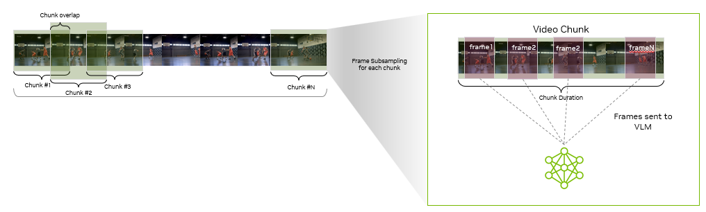

# Customizing the VSS Agent

The VSS Blueprint is up and running and we have worked with the API to process some video. Let's practice that again, but also take a deeper dive into tuning the video ingestion pipeline.

## Streaming Video Ingestion

To ingest streaming video, the stream must first be split into windows of a fixed length. This lenth is called the **sumary duration**.

One summary is generated for each of these clips.

This fixed length clips are then chunked into blocks of length `chunk_duration`. Chunks can overlap each other by `chunk_overlap_duration`. For each chunk, `num_frames_per_chunk` frames will be selected as input to the VLM.

Batch video ingestion is also supported by simply uploading a file that has already been cut to the desired length. This is what we have done so far. For batch video ingestion, the Summary Duration is not relevant.

This excercise will focus on tuning the video chunking. The following table summarizes the expected behavior.

| Parameter | Typical Values | Impact on Accuracy | Impact on Perf. |
| --- | --- | --- | --- |
| Summary Duration | 60s | short duration is better for real-time updates | higher duration is more performant |
| `chunk_duration` | 10s, 30s, 1m | shorter for short actions | longer chunks process faster |
| `chunk_overlap_duration` | 10s | | |
| `num_frames_per_chunk` | 8, 10, 16, 32 | more frames incease accuracy | few frames increase speed |

## Customize off-the-shelf VSS

Open <a style="cursor: pointer;" onclick="openOrCreateFileInJupyterLab('labs/Custom_VSS.ipynb');"><i class="fas fa-flask"></i> labs/Intro_To_VSS.ipynb</a> to get started.

## Wrap up

You just finished customizing the full VSS blueprint with minimal help! You completed the same three steps from before:

1. Gather server information (health + models)
1. Upload the video file
1. Create custom prompts to define behavior

And then moved on to a few optional steps:

1. Tuned video chunking
1. Tuned model parameters

Of course, the blueprint can be customized further by also fine tuning the VLM used to process the video. Unfortunately, that is out of scope today.
