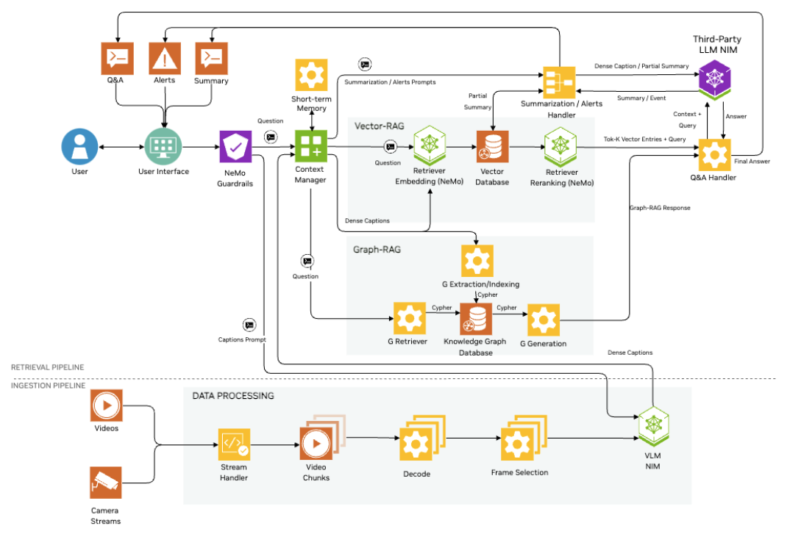

# Introduction to VSS

## Architecture
The Video Search and Summarization is comprised of two pipelines: the **Ingestion** pipeline and the **Retrieval** pipeline.



As video is streamed or uploaded into the agent, the video will be pre-processed into chunks of time intervals. These chunks are then used to generate high level summaries as well as a detailed database of observations.

The combination of these chunked summaries and knowledge database are then used by the Retrival pipeline to summarize and chat with video streams.

<details>
<summary><b>Vector RAG Close Up</b></summary>

```
TODO
```

</details>

<details>
<summary><b>Graph RAG Close Up</b></summary>

```
TODO
```

</details>

<details>
<summary><b>Data Processing Close Up</b></summary>

```
TODO
```

</details>

<details>
<summary><b>Data Processing Close Up</b></summary>

```
TODO
```

</details>

## Meet NIM

This blueprint employs four NVIDIA NIM microservices.

| | |
| --- | --- |
| [meta/llama-3.3-70b-instruct <i class="fas fa-external-link-alt"></i>](https://build.nvidia.com/meta/llama-3_3-70b-instruct) | Large Language Model used for performing Question and Answering and directly chatting with the end user. |
| [nvidia/vila <i class="fas fa-external-link-alt"></i>](https://build.nvidia.com/nvidia/vila) | Multi-modal vision-language model that used for creating informative insights about images and video. |
| [nvidia/nv-embedqa-e5-v5 <i class="fas fa-external-link-alt"></i>](https://build.nvidia.com/nvidia/nv-embedqa-e5-v5) | Embedding model for converting human text into vector representations. |
| [nvidia/llama-3_2-nv-rerankqa-1b-v2 <i class="fas fa-external-link-alt"></i>](https://build.nvidia.com/nvidia/llama-3_2-nv-rerankqa-1b-v2) | Reranking model for determining content most relevant to a user prompt. |

## Explore the API

We will get started by using a Jupyter Notebook to send requests to the Visual Insights Agent's API. An OpenAPI specification for this API is available, and the API can be browsed, at http://HOSTNAME:8100/docs

```
TODO make this a proxied link
```

Open <a style="cursor: pointer;" onclick="openOrCreateFileInJupyterLab('labs/Intro_To_VSS.ipynb');"><i class="fas fa-flask"></i> labs/Intro_To_VSS.ipynb</a> to get started.

## Wrap up


In that excercise, we created a functional system that can help to improve safety in a warehouse.
We did this with three pretty quick steps:

1. Gather server information (health + models)
1. Upload the video file
1. Create custom prompts to define behavior

Once that was complete, the VSS Blueprint's Summarization APIs generated a summary that was that outlined the major events.
We also used those APIs to chat with the video file to perform a net new analysis.

Very cool! In the next excercise, we will dig deeper into the other parameters that can be tuned.