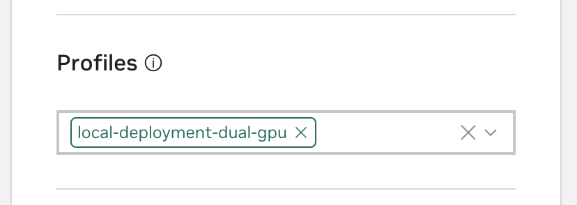

# Start the VSS Services


This NVIDIA Workbench project has been configured to manage the VSS Blueprint microservices.


## Configure Workbench Project

There are two profiles available for this project.

<!-- tabs:start -->

### **Dual GPUs (40GB of RAM or larger)**

Open your AI Workbench window and ensure you are seeing the video-search-and-summarization project. In the project, open `Environment` → `Compose`.

This window is your central control panel for your development copy of the VSS Blueprint. In the `Profile` drop down, select `local-deployment-dual-gpu`.




### **3x GPU (80GB of RAM or larger)**

1. Open your AI Workbench window and ensure you are seeing the video-search-and-summarization project.
    In the project, open `Environment` → `Compose`.

   This window is your central control panel for your development copy of the VSS Blueprint. In the `Profile` drop down, select `local-deployment-multi-gpu`.

    ```
    TODO insert compose view screenshot
    ```

1.  Now, go to `Environment` → `Project Container`.
    Then scroll down to the `Variables` section.
    This is the configuration for your local copy of the VSS blueprint.

    Make the following changes:

    ```
    TODO document which env variables to change

    TODO show env vars view screenshot
    ```

<!-- tabs:end -->

## Start The Services

You can control your blueprint instance in the AI Workbench UI.
The fastest way is on the `Project Dashboard`.

In the `Compose` card, click the `Start` button.
Workbench will now orchestrate the various services that are needed for the blueprint.

Once the status of these containers is `RUNNING`, your blueprint will be ready to go.

```
TODO setup health checks in compose so these indicators will be more accurate

For now, wait for the log file to slow down. Then try hitting the frontend at HOST:9100
```

## Access the Blueprint Interface

Now you are up and running!
Check out the blueprint demo interface by navigating to http://HOSTNAME:9100.

```
TODO enable proxy support in the gradio app

This frontend will be proxied through workbench so you dont have to worry about networking issues. The link in the docs will also be directly to the docs, without placeholders.
```
